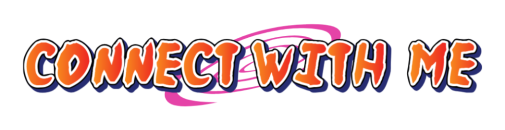

 

  

 

## 

**Languages**
 

**Frontend & Frameworks**
 

**Data & Cloud**
 

**AI & Web3**
 

 
<i>+ RAG pipelines &amp; IBM Watsonx for applied AI &nbsp;·&nbsp; wagmi/viem for on-chain dev</i>

**Tools**
 

 

## 

 

## 

Animated snake eating my contribution graph — powered by a GitHub Action (setup below ⬇️)

 

## 

  

### 💭 Random dev wisdom, refreshed every visit

 

