<pre align="center">
██████╗ ███████╗██████╗  ██████╗ ███████╗██╗███╗   ██╗
██╔══██╗██╔════╝██╔══██╗██╔═══██╗██╔════╝██║████╗  ██║
██████╔╝█████╗  ██████╔╝██║   ██║███████╗██║██╔██╗ ██║
██╔══██╗██╔══╝  ██╔══██╗██║   ██║╚════██║██║██║╚██╗██║
██████╔╝███████╗██║  ██║╚██████╔╝███████║██║██║ ╚████║
╚═════╝ ╚══════╝╚═╝  ╚═╝ ╚═════╝ ╚══════╝╚═╝╚═╝  ╚═══╝
</pre>

<div align="center">

[](https://git.io/typing-svg)

<a href="https://github.com/Berosin"></a>
<a href="https://linkedin.com/in/berosin"></a>


</div>

<br/>

## 📸 A Human, Rendered in Text

<div align="center">


<br/><br/>



<br/>
<sub>↑ yes, that's really me — every glyph above is a pixel of my own photo, and it types itself in once per page load 👋</sub>

</div>

<br/>

## 👨‍💻 About Me

```yaml
whoami:
  name: "Berosin BF"
  role: "Full-stack Developer"
  focus: ["AI / RAG", "Web3 & Smart Contracts", "Cloud-native apps", "Mobile"]
  approach: "Ship end-to-end — frontend to smart contract to inference pipeline"
  fun_fact: "I turn photos into ASCII art for fun (see above ⬆️)"
```

- 🧩 Enjoy taking ambitious ideas — DAO governance, explainable AI, disaster-relief tech — from concept to a working product.
- 🧠 Deep into **RAG pipelines** and applied AI — from cloud knowledge assistants to multilingual financial-literacy bots.
- 🌐 Comfortable across the stack: React/Next.js frontends, Node/Spring Boot/FastAPI backends, Firebase/Supabase/MongoDB/MySQL data layers.
- ⛓️ Exploring Ethereum, Foundry, wagmi/viem for on-chain applications.
- 📱 Also build cross-platform mobile apps with Flutter and native Android.
- 💬 Ask me about: RAG architectures, DAO governance patterns, or shipping full-stack MVPs fast.

<br/>

## 🛠️ Tech Stack

<div align="center">

<sub>**Languages**</sub>
<br/>


<br/><br/>

<sub>**Frontend & Frameworks**</sub>
<br/>


<br/><br/>

<sub>**Data & Cloud**</sub>
<br/>


<br/><br/>

<sub>**AI & Web3**</sub>
<br/>

<br/>
<sub><i>+ RAG pipelines &amp; IBM Watsonx for applied AI &nbsp;·&nbsp; Foundry &amp; wagmi/viem for on-chain dev</i></sub>

</div>

<br/>

## 🚀 Featured Projects

<table>
<tr>
<td width="50%">

### ⭐ [Relivio](https://github.com/Berosin/Relivio)
Transparent, community-governed emergency relief platform combining blockchain governance with explainable AI.

`Next.js` `TypeScript` `Ethereum` `Foundry` `FastAPI` `AI`

</td>
<td width="50%">

### ⭐ [ANORA](https://github.com/Berosin/ANORA)
AI-powered cloud knowledge intelligence platform using RAG for grounded answers, summaries, and comparisons.

`React` `Node.js` `FastAPI` `MongoDB` `RAG`

</td>
</tr>
<tr>
<td width="50%">

### ⭐ [QwikQ](https://github.com/Berosin/QwikQ)
Smart queue management app — book tokens remotely and track your position in real time.

`Flutter` `Dart` `Supabase`

</td>
<td width="50%">

### ⭐ [SafeSpend AI](https://github.com/Berosin/SafeSpend-AI)
Multilingual AI assistant for digital financial literacy, powered by RAG and IBM Watsonx.

`Python` `RAG` `Watsonx` `AI`

</td>
</tr>
<tr>
<td width="50%">

### ⭐ [Overclock '26](https://github.com/Berosin/Overclock-26)
Manga-inspired, eight-arc tech symposium website with an interactive visual experience.

`React` `Vite` `JavaScript`

</td>
<td width="50%">

### ⭐ [CloudVault](https://github.com/Berosin/CloudVault)
Full-stack cloud file storage app for uploading, sharing, and managing files.

`Spring Boot` `Firebase` `Supabase`

</td>
</tr>
</table>

<details>
<summary><b>📂 More repositories</b></summary>
<br/>

- 🌱 [smart-crop-health-monitor](https://github.com/Berosin/smart-crop-health-monitor)
- 🔎 [trace](https://github.com/Berosin/trace)
- 💳 [Credit-Card-Processing-System](https://github.com/Berosin/Credit-Card-Processing-System)
- 🎨 [Portfolio-animation](https://github.com/Berosin/Portfolio-animation)
- 🏋️ [gym-management-system](https://github.com/Berosin/gym-management-system)
- 🛒 [emart-inventory-management](https://github.com/Berosin/emart-inventory-management)
- 📝 [microblog](https://github.com/Berosin/microblog)
- 🧩 [Leetcode](https://github.com/Berosin/Leetcode)

</details>

<br/>

## 📊 GitHub Stats

<div align="center">


</div>

<br/>

<details>
<summary><b>🧪 How the portrait &amp; info card are built (click to expand)</b></summary>
<br/>

Two hand-rolled Python scripts turn a plain photo into the self-typing SVG art above — no external ASCII-art service involved.

**Setup** — `scripts/requirements.txt` lists everything needed. The daily automation only needs `requests` + `beautifulsoup4`; the portrait libraries (`pillow`, `numpy`, `opencv-python`, `rembg`) only matter when you swap in a new photo:

```bash
python -m venv .venv && source .venv/bin/activate
pip install -r scripts/requirements.txt
```

**Step 1 — Prep the photo** (`scripts/prep_photo.py`). A flatly-lit face converts to a dark, unreadable blob, so this script: removes the background with `rembg`, boosts local contrast with OpenCV's CLAHE, then composites onto pure white so the background maps to blank space in the ASCII ramp.

```bash
python scripts/prep_photo.py source-photo.jpg
```

**Step 2 — Convert to a self-typing SVG** (`scripts/make_ascii_svg.py`). The prepped image is downsampled to a ~100×53 character grid; each pixel's brightness picks a glyph from a density ramp (`" .`:-=+*cs#%@"`, bright → sparse, dark → dense). It's rendered **monochrome** — one light-gray fill, no per-character rainbow — and each row wipes in left-to-right with a small cursor block, staggered top-to-bottom, printing once and freezing (SMIL, no loop).

```bash
python scripts/make_ascii_svg.py source-photo-prepped.png -o avi-ascii.svg
```

**Step 3 — Build the neofetch-style info card** (`scripts/make_info_card.py`). A small hand-authored SVG with a title bar and `Now` / `Prev` / `Stack` / `Highlights` rows that fade + slide in on a stagger — the story the stats widgets above can't tell. Set `STATIC=1` for a frozen frame (handy for local previews).

```bash
python scripts/make_info_card.py -o info-card.svg
```

Commit `avi-ascii.svg` and `info-card.svg` to the repo root and the README picks them up automatically.

**Prefer it fully automatic?** `.github/workflows/portrait.yml` runs this same pipeline weekly (and on-demand from the Actions tab), pulling your avatar directly from `https://github.com/<username>.png` — GitHub's live avatar URL — via `scripts/fetch_avatar.py`. Change your profile picture on GitHub and the portrait updates itself on the next run, no manual re-upload needed.

</details>

<br/>

## 🐍 Contribution Snake

<div align="center">


<sub>Animated snake eating my contribution graph — powered by a GitHub Action (setup below ⬇️)</sub>

</div>

<br/>

## 📈 Activity Graph

<div align="center">


</div>

<br/>

<div align="center">

## 🤝 Connect With Me

<a href="https://linkedin.com/in/berosin"></a>
&nbsp;
<a href="https://github.com/Berosin"></a>

<br/><br/>

### 💭 Random dev wisdom, refreshed every visit


<br/>


</div>